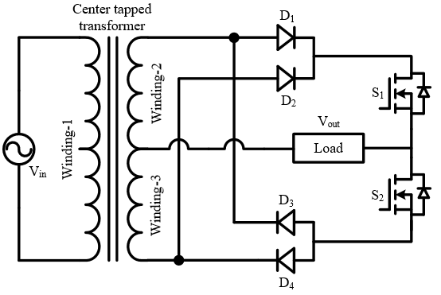
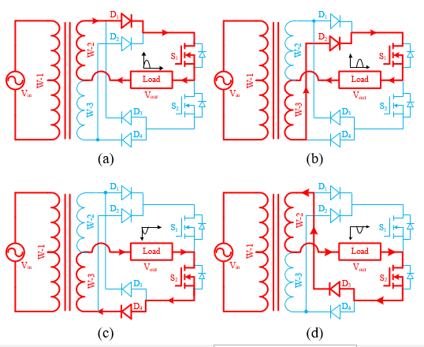
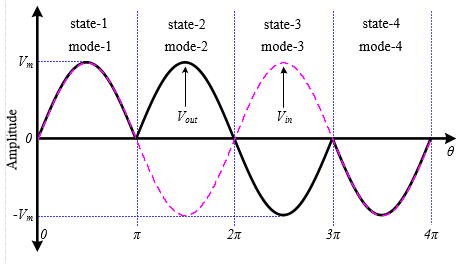
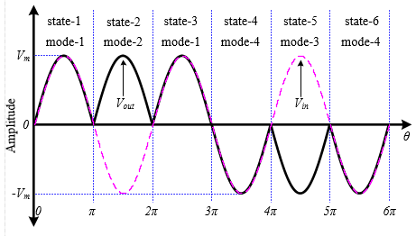
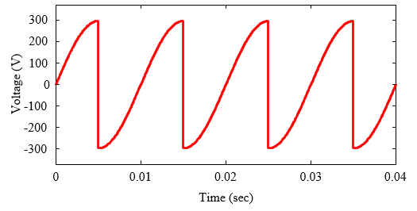
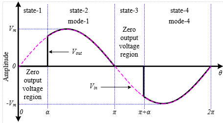
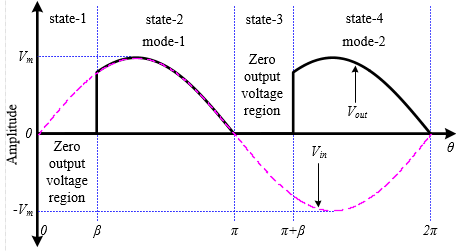
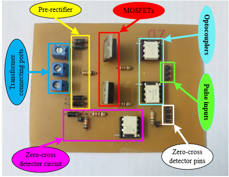

# Two-Switch-Multiconverter
Single-phase to single-phase multiconverter laboratory prototype hardware design and drive.

It presents a novel single-phase to single-phase multiconverter topology that can be applied in multiple areas including:

        1. Frequency up converter
        2. Frequency down converter
        3. AC volatge regulator
        4. DC volatge regulator

### Circuit Diagram
The following figure shows the single-phase to single-phase multiconverter circuit topology. It uses only two soft power semiconductor switches (e.g. MOSFET or IGBT), four power diodes and a center-tapped transformer which makes it more compact in size, decrease the gate driving complexity, reduce the total equipment costs and enhance the energy conversion efficiency with minimized losses.

### Operating Principle
There are four common working modes of this converter during all of the active conversion modes which are shown as following figure. Thus, the explanation of these four working modes help to understand the operating principle of the converter as any of the aforesaid converter. 

### Multi-converter Applications
Nevertheless, the working principle of the proposed multiconverter is described according to the individual active energy conversion mode in the following subsections.

#### 1. Step-Down Frequency Converter
Generally, the step-down cycloconverter provides an output voltage of frequency less than the frequency of the input voltage. The presented converter can be operated to convert the input frequency to its half (25 Hz), one-third (17 Hz), one-fourth (12.5 Hz) and so on output frequency as a step-down cycloconverter. Here, only two frequency conversion i.e. half (25 Hz) and one-third (17 Hz) frequency conversions are shown.

#### 2. Step-Up Frequency Converter
When the frequency of the input voltage is needed to increase for certain applications such as induction heating, step-up cycloconverter is used. A high frequency resonant circuit can heat a body situated within its range. The higher the frequency, the larger amount of heat is induced. Thus, the step-up cycloconverter is suitable for induction heating. However, the operating principle of the multiconverter as a step-up cycloconverter is explained for generating the output frequency twice of the input i.e. 100Hz, for ease of understanding.

#### 3. AC volatge regulator
In order to control the RMS value of the input voltage by keeping the frequency constant, the AC voltage controller i.e. AC voltage regulator is used. The converter can be operated at the input frequency to control the input voltage according to the switching pulses shown in following figure.

#### 4. Controlled Rectifier
During the operation of the converter as a controlled rectifier, state-2 and state-4 are achieved by applying the active working mode-1 and mode-2 respectively as represented in the following figure. The zero voltage regions (i.e. state-1 and state-3) are defined by the control angle β during both positive and negative half cycle of the input voltage. 

### Hardware Implementation
The prototype is made up of power MOSFETs (STP60NF06) and power diodes (1N5822), and a 12V stepped-down AC voltage produced by a center trapped transformer is used as input supply during experiment. In order to drive the gates of the switches, the switching signals are generated using Arduino Uno (ATMega328p) processor board and then, they are boosted up through the driver circuits developed with optocouplers (TLP250) and isolated DC-DC converters (B1212s). Finally, the boosted pulses are applied to the gates of the switches using the synchronization mechanism offered by the zero-cross detector circuits, and then, the output voltages are recorded across resistive load on the oscilloscope screen. The following figure shows the designed hardware prototype.

### Output
The following figures show the output voltage of the mid point type cycloconverter taking from a two channel digital oscilloscope.

